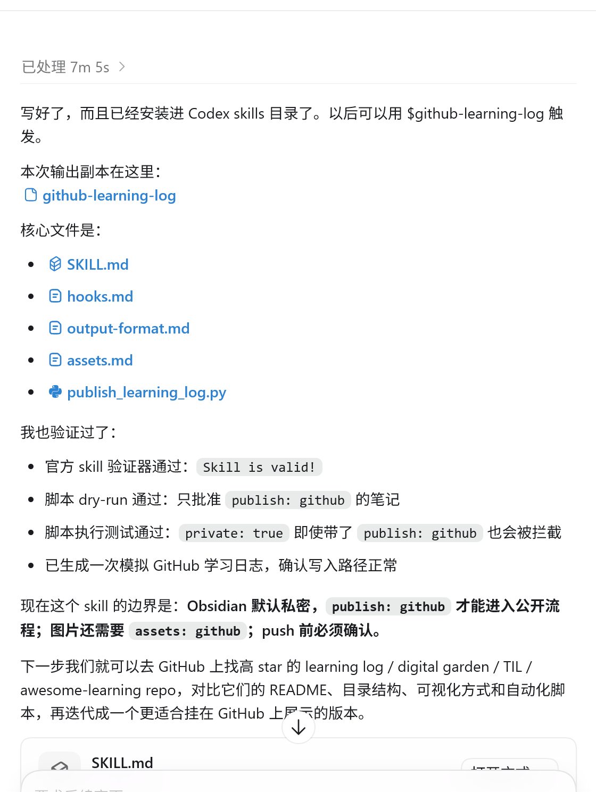

# 2026-06-18 AI 学习 small step

## 今天的学习内容

今天理解了skill 的基本结构：它不是把所有内容一次性塞给 agent，而是用“渐进式披露”让 agent 在需要的时候再加载对应信息。

我现在理解的三层结构是：

- 元数据层：始终可见，用来判断这个 skill 什么时候应该被触发
- 指令层：触发 skill 后按需加载，告诉 agent 应该怎样做
- 资源层：包括 references 和 scripts，只在需要时读取或执行

 skill 和 MCP 的区别：

- MCP 更像是给 agent 提供数据、工具或外部能力
- skill 更像是教 agent 如何处理一类任务和工作流

## 今天的小实践
和codex协作写了一个skill，用了skill-creator的skill，学到手的知识立即实践好有满足感 嘿嘿😁

## 看看图片。。(#^.^#)

## 参考来源

- [Skill learning video](https://youtu.be/HQGUed-e2wM?si=uHjZpJkm8Y5qTB7V)

## 设想的下一步

去 GitHub 上找一些高 star 的公开学习记录仓库，对比它们的 README、目录结构、可视化方式和自动化脚本，再迭代自己的版本。
